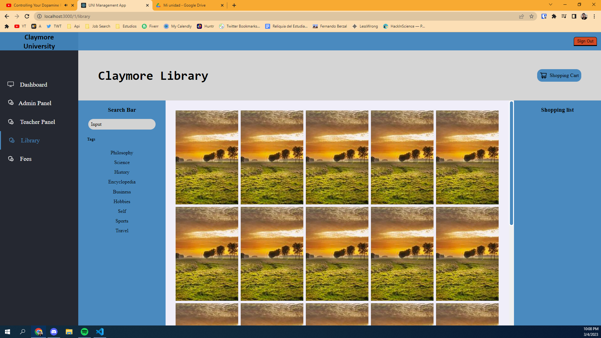

# University Management App

Idea from [sharpen.design](sharpen.design)  

## Accounts:

| Email | Password | Account Type | Privileges |
| ------- | ------ | ------------ | ---------- |
|   admin@placeholder.com | Abc123! | Admin | Admin Privileges |
|   treasurer@placeholder.com | Abc123! | Treasurer | Treasurer, Teacher, Librarian, Advisor, Student |
|   Teacher@placeholder.com | Abc123! | Teacher | Teacher, Librarian, Advisor, Student |
|   Librarian@placeholder.com | Abc123! | Librarian | Librarian, Advisor, Student | 
|   Advisor@placeholder.com | Abc123! | Librarian | Advisor, Student | 
|   Student@placeholder.com | Abc123! | Student | Student | 
## Packages:

### Frontend Libraries:  

[React](https://github.com/facebook/react)    
[React-router-dom](https://github.com/remix-run/react-router)  
[React-hook-form](https://react-hook-form.com/get-started/)  
[React-redux](https://react-redux.js.org/)  
[React icons](https://react-icons.github.io/react-icons/search?q=admi)  
[Axios](https://axios-http.com/)

Testing done in [React-testing-library](https://testing-library.com/docs/react-testing-library/intro/)  
CSS preprocessed with [Sass](https://sass-lang.com/)  

### Backend Libraries:

[express-async-handler](https://github.com/Abazhenov/express-async-handler)  
[bcryptjs](https://github.com/dcodeIO/bcrypt.js)  
[cors](https://github.com/expressjs/cors)  
[dotenv](https://github.com/motdotla/dotenv)  
[express](https://expressjs.com/es/)  
[jsonwebtoken](https://www.npmjs.com/package/jsonwebtoken)  
[pg](https://github.com/brianc/node-postgres)
[graphql][https://graphql.org/]

### Database:

Database Design from [here](https://www.onomastics.kz/uploads/books/abai-qunanbaevnbXtk.pdf)  

## Design:

DESIGNS TAKEN AS REFERENCE AND IMPROVISED OVER THEM.

Design from [here](https://www.sideprojectors.com/project/13673/university-management-systemadminteacherstudent)  
Database Design from [here](https://www.onomastics.kz/uploads/books/abai-qunanbaevnbXtk.pdf)  
This search helped me a lot [Google Search](https://www.google.com/search?q=university+management+system+project&rlz=1C1ONGR_esAR1016AR1016&tbm=isch&sxsrf=AJOqlzUqROKRm6YsvZcQxqxf31gGDIwkaw:1677037853003&source=lnms&sa=X&ved=2ahUKEwjx7YLsnKj9AhW2rJUCHRzgDzUQ_AUoAnoECAoQBA&biw=2560&bih=937&dpr=1#imgrc=iwxUAxrO9jYy9M)  
Library Design from [here](https://www.behance.net/gallery/137500455/Book-Books-A-Books-Library-Web-App-Design?tracking_source=search_projects%7CLibrary+Webapp)

Student Dashboard:
[ADi7YA26/Student-Dashboard](https://github.com/ADi7YA26/Student-Dashboard)

## Guides that helped me:  

[Rutas privadas con ReactRouterDomV6](https://www.youtube.com/watch?v=tqc8n3odVp0)  
[React router Private Routes](https://www.robinwieruch.de/react-router-private-routes/)  
[Aprende React Router 6 en 30 minutos](https://www.youtube.com/watch?v=JNhhdkCuyog)  
[Handling user authentication redux toolkit](https://blog.logrocket.com/handling-user-authentication-redux-toolkit/#prerequisites)  
[CRUD REST API with Node.js Express.js and Postgresql](https://blog.logrocket.com/crud-rest-api-node-js-express-postgresql/)

## To do: 

- [X] Router  
- [ ] Pages:  
    - [ ] Login      
    - [ ] Admin Panel    
    - [ ] Dashboard  
    - [ ] Treasury    
    - [ ] Teachers  
    - [ ] Students  
    - [ ] Courses  
    - [ ] Exams  
    - [ ] Calendar  
- [ ] Models:
    - [ ] User    
    - [ ] Course   
    - [ ] Event    
- [ ] Tests  
- [ ] Course Inscription  
    - [ ] Correlative Courses  

## Pages:

